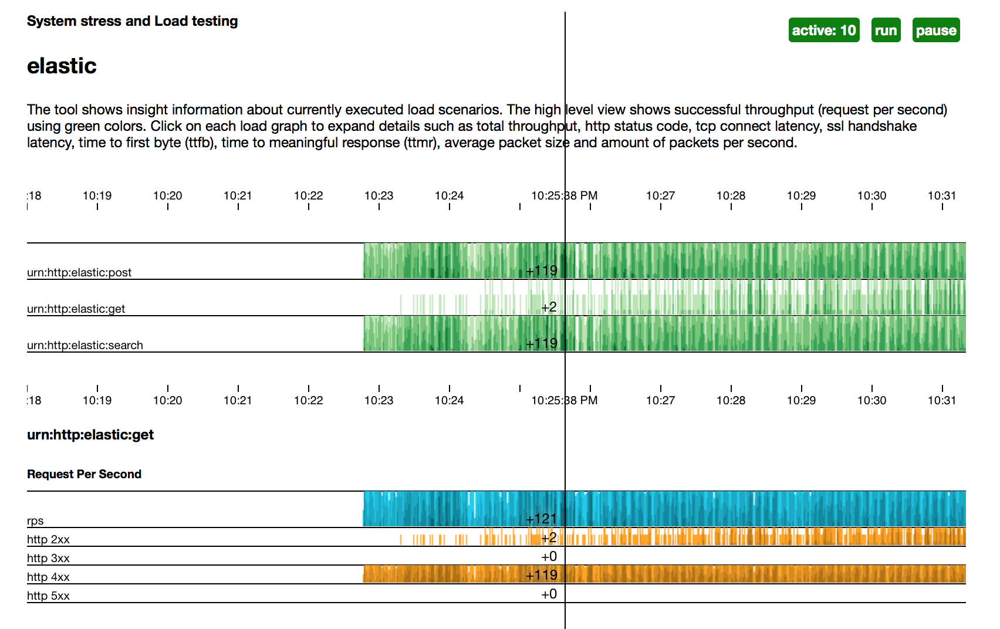

# typhoon

Typhoon is distributed system stress and load testing tool. The tool simulates a traffic from test cluster towards system-under-test (SUT). The purposes of tool is validation of systems performance and scalability, while spawning huge number of concurrent sessions. The tool provides out-of-box cross-platform solution to investigate protocol and application latencies. It approximates Network delay, Round Trip Time, TLS Handshake, Time-to-First-Byte and Time-to-Meaningful-Response; evaluates protocol overhead by approximating packet metrics and estimates application performance.
      
The typhoon is operable as standalone application and scalable up to dozens of individual nodes hosted in cloud environment. The incremental scalability and decentralization are key principles used to define the architecture. The peer-to-peer clustering based on consistent hashing, this is a key technology to assembles and orchestrates load toward SUT. It helps the system to deal with possible network failures and provide hight availability for synthetic load and telemetry collections (the optimistic technique to replicate data has been employed by the design). 

The tool provides REST interface to build, define and spawn workload scenarios; collect the telemetry and visualize results. 


## inspiration

The tool is a continuation of scalability and latency analysis efforts driven by tech companies within the mobile application domain. For example Nokia's contribution to latency analysis on cellular networks... Google's proposals on web protocol enchantment and evolutions...  

It uses Erlang as runtime environment due to massive scalability and soft real-time properties (accuracy on measurements) . It recommended itself as indispensable technology in similar solution Tsung suitable to test scalability and performance of IP based applications.

Typhoon focuses on **visualization**, **protocol metric** and **usability**. The time-series data visualization crisis is well depicted [here](https://bost.ocks.org/mike/cubism/intro/#0), the usage of proposed visualization technique (cubism.js) improves readability and analysis of latencies experienced by SUT. The design of distributed systems and micro-services requires deep-dive understanding of latencies introduced by infrastructure, protocol and application. Typhoon captures and visualize them. It allows to solve a series of decision problem concerning both short-term and long-term arrangements: short term decisions include for example the determination of optimal software configuration, the number of servers, the number of concurrent connections; long term decisions include for example decisions concerning the development and extension of data and service architecture, choice of technology, runtime environment, etc. The tools defines methods for controlling that the actual end-to-end latency is fulfilling the requirements, and also to specify emergency actions when systems are overloaded or technical faults occur.


## getting started


### getting typhoon

The project supplies pre-build release for Linux/x86_64, MacOS/10.10.x and Docker platforms. Instructions for using these binaries are on the [GitHub releases page](https://github.com/zalando/typhoon/releases).

The latest version of `typhoon` can be build from `master` branch. The build process requires [Erlang/OTP](http://www.erlang.org/downloads) version 18.0 or later. All development, including new features and bug fixes, take place on `master` branch using forking and pull requests as described in [contribution guideline](docs/contribution.md).


### running typhoon

The docker container is easiest way to run standalone instance of the application. The option is viable only if either [docker toolbox](https://www.docker.com/products/docker-toolbox) or docker daemon is configured at your environment:
```
docker run -it -p 8080:8080 registry.opensource.zalan.do/typhoon:x.y.z
```

This will start single typhoon node as docker container. It exposes services using rest api on port 8080 (by default it is bound to following ip address 192.168.99.100 on MacOS, please check your docker configuration on other platforms).  

It is possible to spawn the tool using native platform binaries, see the installation instructions on the [GitHub releases page](https://github.com/zalando/typhoon/releases). 
```
/usr/local/typhoon-x.y.z foreground
```

This bring typhoon up and running. The application uses local ip 127.0.0.1 and port 8080 to offer services.

Use following command to check if the application is up and running and the rest api is exposed. The application should return list of cluster peers `["typhoon@127.0.0.1"]`.   
```
curl http://192.168.99.100:8080/health/peer
```


### deploying typhoon
tbd


### running local typhoon cluster


tbd


### continue to...

* specification of [workload scenario](docs/unit.md)
* explore [rest interface](docs/restapi.yaml)


## project details

### architecture
[See specification](docs/arch.md)


## contributing
See [contribution guideline](docs/contribution.md) for details on PR submission.


## bugs
See [bug reporting](docs/bugs.md) for guidelines on raising issues. 


## contacts

* email: dmitry.kolesnikov@zalando.fi
* bugs: [here](https://github.com/zalando/typhoon/issues) 

<!-- 

## build

The project requires Erlang/OTP development environment [check here instructions](docs/erlang.md) and essential development tool sets such as `git`, `make`, etc. The project provides binary files for Linux x86_64 and MacOS 10.10.x platforms (see releases).

Use following commands to compile and make distributable package for your platform. The output is self-deployable bundle package ```typhoon-{vsn}+{head}.{arch}.{plat}.bundle```

```
   make
   make pkg
```

It is possible to assemble cross platform packages on MacOS. However it requires docker tool kit and docker image with Erlang/OTP environment. 

```
   make
   make pkg PLAT=Linux 
```

## configuration

[See config file](docs/config.md)


## usage

The tool provides rest api to manage load and stress test scenarios using curl command line
utility and implement html interface to visualize measurements. The load scenario is [json file](docs/unit.md)

Use browser to inspect the progress of the executed test ```http://localhost:8080/:id``` once test specification is defined to the cluster.



### define load scenario

```
curl -XPUT \
   http://localhost:8080/scenario/:id \
   -H 'Content-Type: application/json' \
   -d @myload.json
```

### remove load scenario

```
curl -XDELETE \
   http://localhost:8080/scenario/:id
```

### read load scenario

```
curl -XGET \
   http://localhost:8080/scenario/:id
```

### execute load scenario

```
curl -XGET \
   http://localhost:8080/scenario/:id/spawn
```

## known issues

* The current version is optimized for http(s) protocol only, support for other protocols and protocol plug-in interface is planned for future releases

* Scenario files are stored in-memory. However cluster manages 3 replicas.
 -->

# License

Copyright 2015 Zalando SE

Licensed under the Apache License, Version 2.0 (the "License"); you may not use this file except in compliance with the License. You may obtain a copy of the License at http://www.apache.org/licenses/LICENSE-2.0.

Unless required by applicable law or agreed to in writing, software distributed under the License is distributed on an "AS IS" BASIS, WITHOUT WARRANTIES OR CONDITIONS OF ANY KIND, either express or implied. See the License for the specific language governing permissions and limitations under the License.
